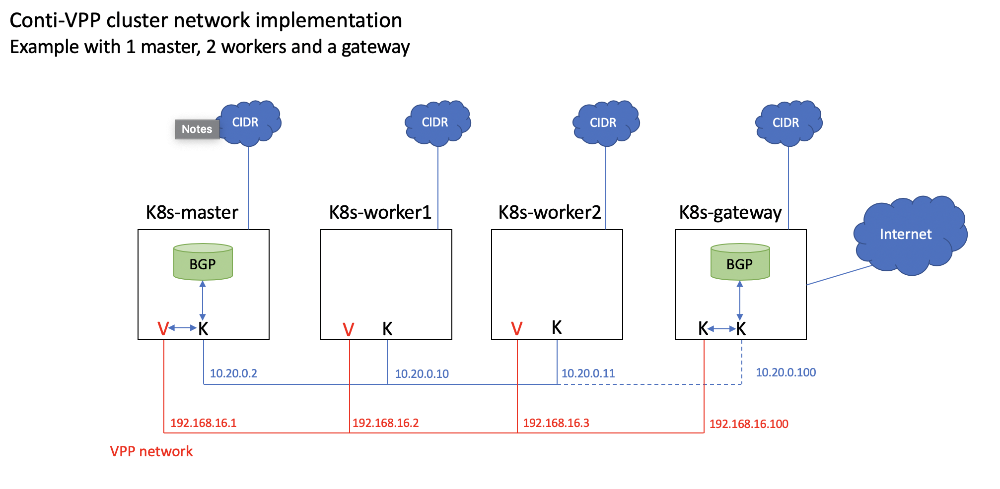
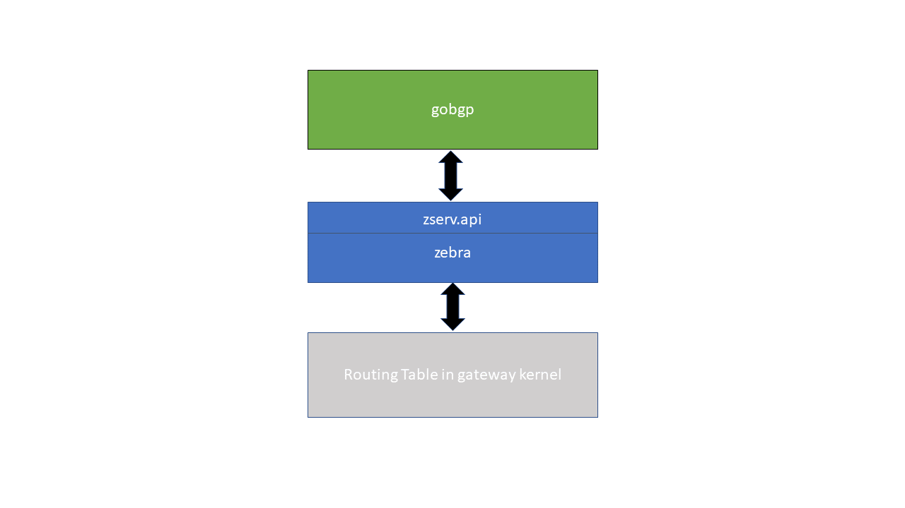
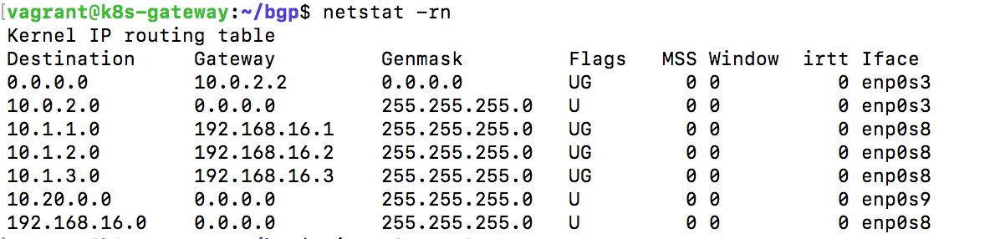

# bgp-vpp
A BGP Speaker implementation for Contiv-VPP

Please follow instructions in https://github.com/osrg/gobgp to get your off-the-shelf gobgp set up. Make sure to add the master node as a neighbor to the gateway.

# Quagga Setup for the Gateway node



First, edit the gateway's off-the-shelf bbgpd.conf file to enable zebra feature:

```
[zebra]
    [zebra.config]
        enabled = true
        url = "unix:/var/run/quagga/zserv.api"
        redistribute-route-type-list = ["connect"]
        version = 2
```
Next, to set install quagga on the gateway do the following:
```
  $ sudo su //ensure that sudo is being used if you decide to not use this command to start
  # apt-get update
  # apt-get install quagga quagga-doc
```
Then, configure Quagga daemons by editing the file /etc/quagga/daemons to start the zebra daemon.
```
# nano /etc/quagga/daemons
```
Configure the deamons file as such:
```
zebra=yes
bgpd=no
ospfd=no
ospf6d=no
ripd=no
ripngd=no
isisd=no
babeld=no

```
Next, create config files for the zebra daemon. You can you the sample installed with quagga-doc:
```
# cp /usr/share/doc/quagga/examples/zebra.conf.sample /etc/quagga/zebra.conf
# chown quagga.quaggavty /etc/quagga/*.conf
# chmod 640 /etc/quagga/*.conf
```
Start Quagga:
```
# /etc/init.d/quagga start
```
Now you will need to run the gateway by using the command:
```
$ sudo -E ./gobgpd -f ./gobgpd.conf
```
You will also need to run the executable GoBGP that you create in GoLand to run bgp on the master:
```
$ go run main.go
```
Finally, check if your network is set up by viewing the routing table in the gateway using:
```
$ netstat -rn
```
An example of the Routing Table will appear as follows. The gateway node should learn the different CIDR subnets with the appropriate IP-VPP as the next hop.




You will also be able to ping the connection.

#Referenced https://www.brianlinkletter.com/how-to-build-a-network-of-linux-routers-using-quagga/
